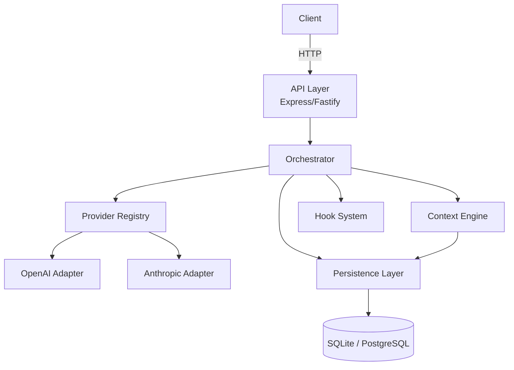
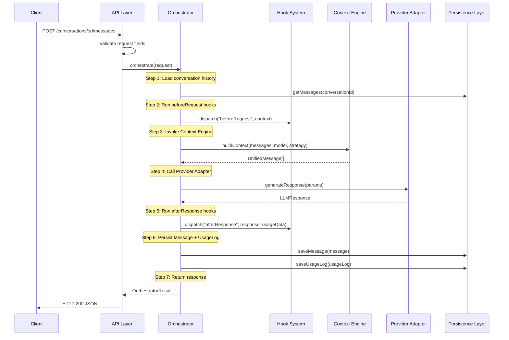

# Design Document: Multi-LLM Orchestration Platform

## Overview

The Multi-LLM Orchestration Platform is a single-process, TypeScript/Node.js backend service that enables users to hold persistent conversations while routing individual messages to different LLM providers. The system is structured as a set of composable, loosely-coupled modules that communicate through well-defined interfaces rather than direct dependencies.

The core design philosophy is **interface-driven extensibility**: every integration point (providers, trimming strategies, lifecycle hooks) is expressed as a TypeScript interface or injected dependency, so new implementations can be added without touching existing code.

### Key Design Decisions

- **Single service, modular layers** — no microservices; complexity is managed through module boundaries and dependency injection rather than network boundaries.
- **Registry pattern for providers** — the Orchestrator never imports a provider directly; it resolves adapters by name from a registry at request time.
- **Strategy pattern for context trimming** — the Context Engine accepts a `TrimStrategy` function as a constructor argument, making V1 (FIFO) and future V2 (summarization) interchangeable.
- **Hook system as a side-channel** — hooks are fire-and-forget observers; a failing hook never interrupts the main pipeline.
- **SQLite for development, PostgreSQL for production** — the persistence layer is abstracted behind a repository interface so the underlying database can be swapped without touching business logic.

---

## Architecture

### Module Dependency Graph



### Request Lifecycle (Strict 7-Step Flow)



### File and Module Layout

```
src/
├── index.ts                        # Entry point — wires all modules, starts server
├── config.ts                       # Environment variable loading and validation
│
├── types/
│   ├── unified-message.ts          # UnifiedMessage type
│   ├── llm-response.ts             # LLMResponse type
│   ├── provider.ts                 # Provider interface
│   ├── hook.ts                     # HookEvent, HookFn types
│   └── index.ts                    # Re-exports
│
├── api/
│   ├── router.ts                   # Route definitions
│   ├── middleware/
│   │   ├── validate-request.ts     # Request field validation
│   │   └── error-handler.ts        # Global error boundary middleware
│   └── handlers/
│       ├── conversations.ts        # Create / get conversation handlers
│       └── messages.ts             # Send message handler
│
├── orchestrator/
│   └── orchestrator.ts             # Core 7-step pipeline
│
├── context-engine/
│   ├── context-engine.ts           # Context assembly + strategy dispatch
│   ├── strategies/
│   │   └── fifo-trim.ts            # V1 FIFO trimming strategy
│   └── token-counter.ts            # Approximate token counting utility
│
├── providers/
│   ├── registry.ts                 # ProviderRegistry — name → Provider map
│   ├── openai-adapter.ts           # OpenAI Chat Completions adapter
│   └── anthropic-adapter.ts        # Anthropic Messages API adapter
│
├── hooks/
│   └── hook-system.ts              # registerHook, dispatch, error isolation
│
├── persistence/
│   ├── db.ts                       # Database connection (Knex or better-sqlite3)
│   ├── migrations/                 # SQL migration files
│   │   └── 001_initial_schema.sql
│   ├── repositories/
│   │   ├── user-repository.ts
│   │   ├── conversation-repository.ts
│   │   ├── message-repository.ts
│   │   └── usage-log-repository.ts
│   └── cost-rates.ts               # Per-provider, per-model cost rate table
│
└── utils/
    ├── logger.ts                   # Structured logger (pino or winston)
    └── errors.ts                   # Typed error classes
```

---

## Components and Interfaces

### Core Type Definitions

```typescript
// types/unified-message.ts
export type MessageRole = "system" | "user" | "assistant";

export interface UnifiedMessage {
  role: MessageRole;
  content: string;
}

// types/llm-response.ts
export interface LLMResponse {
  content: string;
  tokens_in: number;
  tokens_out: number;
  latency_ms: number;
  model: string;
  error?: LLMError;
}

export interface LLMError {
  error_code: string;
  message: string;
}

// types/provider.ts
export interface GenerateParams {
  model: string;
  messages: UnifiedMessage[];
  temperature?: number;
  max_tokens?: number;
}

export interface Provider {
  generateResponse(params: GenerateParams): Promise<LLMResponse>;
}

// types/hook.ts
export type HookEvent = "beforeRequest" | "afterResponse" | "onError";

export interface BeforeRequestContext {
  conversation_id: string;
  provider: string;
  model: string;
  messages: UnifiedMessage[];
}

export interface AfterResponseContext {
  response: LLMResponse;
  usage: UsageLogData;
}

export interface OnErrorContext {
  error: Error | LLMError;
  conversation_id?: string;
  provider?: string;
  model?: string;
}

export type HookFn<T = unknown> = (context: T) => void | Promise<void>;
```

### Provider Registry

```typescript
// providers/registry.ts
export class ProviderRegistry {
  private adapters = new Map<string, Provider>();

  register(name: string, adapter: Provider): void {
    // Validates that adapter satisfies Provider interface at registration time
    if (typeof adapter.generateResponse !== "function") {
      throw new Error(
        `Provider "${name}" does not implement required generateResponse method`
      );
    }
    this.adapters.set(name, adapter);
  }

  resolve(name: string): Provider {
    const adapter = this.adapters.get(name);
    if (!adapter) {
      throw new Error(`No provider registered with name "${name}"`);
    }
    return adapter;
  }

  list(): string[] {
    return Array.from(this.adapters.keys());
  }
}
```

### Context Engine

```typescript
// context-engine/context-engine.ts
export type TrimStrategy = (
  messages: UnifiedMessage[],
  tokenLimit: number,
  countTokens: (msgs: UnifiedMessage[]) => number
) => { trimmed: UnifiedMessage[]; removedCount: number };

export interface ContextEngineOptions {
  trimStrategy: TrimStrategy;
  modelTokenLimits: Record<string, number>;
}

export class ContextEngine {
  constructor(private options: ContextEngineOptions) {}

  buildContext(
    history: UnifiedMessage[],
    model: string
  ): { messages: UnifiedMessage[]; trimmedCount: number } {
    const limit = this.options.modelTokenLimits[model] ?? 4096;
    const { trimmed, removedCount } = this.options.trimStrategy(
      history,
      limit,
      countTokens
    );
    if (removedCount > 0) {
      logger.info({ model, removedCount, reason: "token_limit_exceeded" },
        "Context trimmed");
    }
    return { messages: trimmed, trimmedCount: removedCount };
  }
}
```

### Orchestrator

```typescript
// orchestrator/orchestrator.ts
export interface OrchestratorRequest {
  conversation_id: string;
  content: string;
  provider: string;
  model: string;
  temperature?: number;
  max_tokens?: number;
}

export interface OrchestratorResult {
  message: { role: "assistant"; content: string };
  usage: UsageLogData;
}

export class Orchestrator {
  constructor(
    private registry: ProviderRegistry,
    private contextEngine: ContextEngine,
    private hookSystem: HookSystem,
    private db: {
      conversations: ConversationRepository;
      messages: MessageRepository;
      usageLogs: UsageLogRepository;
    },
    private costRates: CostRateTable
  ) {}

  async process(req: OrchestratorRequest): Promise<OrchestratorResult> {
    // Step 1: Load conversation history
    // Step 2: Run beforeRequest hooks
    // Step 3: Invoke Context Engine
    // Step 4: Call Provider Adapter
    // Step 5: Run afterResponse hooks
    // Step 6: Persist Message + UsageLog
    // Step 7: Return response
  }
}
```

### Hook System

```typescript
// hooks/hook-system.ts
export class HookSystem {
  private hooks = new Map<HookEvent, HookFn[]>();

  registerHook(event: HookEvent, fn: HookFn): void {
    if (!this.hooks.has(event)) {
      this.hooks.set(event, []);
    }
    this.hooks.get(event)!.push(fn);
  }

  async dispatch(event: HookEvent, context: unknown): Promise<void> {
    const fns = this.hooks.get(event) ?? [];
    for (const fn of fns) {
      try {
        await fn(context);
      } catch (err) {
        // Hook failure is isolated — log and continue
        logger.error({ event, err }, "Hook threw an exception");
      }
    }
  }
}
```

### Provider Adapters

```typescript
// providers/openai-adapter.ts
export class OpenAIAdapter implements Provider {
  constructor(private client: OpenAI) {}

  async generateResponse(params: GenerateParams): Promise<LLMResponse> {
    const start = Date.now();
    try {
      const response = await this.client.chat.completions.create({
        model: params.model,
        messages: params.messages, // UnifiedMessage is compatible with OpenAI format
        temperature: params.temperature,
        max_tokens: params.max_tokens,
      });
      return {
        content: response.choices[0].message.content ?? "",
        tokens_in: response.usage?.prompt_tokens ?? 0,
        tokens_out: response.usage?.completion_tokens ?? 0,
        latency_ms: Date.now() - start,
        model: params.model,
      };
    } catch (err) {
      return {
        content: "",
        tokens_in: 0,
        tokens_out: 0,
        latency_ms: Date.now() - start,
        model: params.model,
        error: { error_code: "OPENAI_ERROR", message: String(err) },
      };
    }
  }
}

// providers/anthropic-adapter.ts
export class AnthropicAdapter implements Provider {
  constructor(private client: Anthropic) {}

  async generateResponse(params: GenerateParams): Promise<LLMResponse> {
    const start = Date.now();
    // Anthropic separates system messages from the messages array
    const systemMsg = params.messages.find((m) => m.role === "system");
    const conversationMsgs = params.messages.filter((m) => m.role !== "system");
    try {
      const response = await this.client.messages.create({
        model: params.model,
        system: systemMsg?.content,
        messages: conversationMsgs.map((m) => ({
          role: m.role as "user" | "assistant",
          content: m.content,
        })),
        max_tokens: params.max_tokens ?? 1024,
        temperature: params.temperature,
      });
      return {
        content:
          response.content[0].type === "text" ? response.content[0].text : "",
        tokens_in: response.usage.input_tokens,
        tokens_out: response.usage.output_tokens,
        latency_ms: Date.now() - start,
        model: params.model,
      };
    } catch (err) {
      return {
        content: "",
        tokens_in: 0,
        tokens_out: 0,
        latency_ms: Date.now() - start,
        model: params.model,
        error: { error_code: "ANTHROPIC_ERROR", message: String(err) },
      };
    }
  }
}
```

---

## Data Models

### Database Schema

```sql
-- migrations/001_initial_schema.sql

CREATE TABLE users (
  id          TEXT PRIMARY KEY,          -- UUID v4
  created_at  TIMESTAMP NOT NULL DEFAULT CURRENT_TIMESTAMP
);

CREATE TABLE conversations (
  id          TEXT PRIMARY KEY,          -- UUID v4
  user_id     TEXT NOT NULL REFERENCES users(id) ON DELETE CASCADE,
  created_at  TIMESTAMP NOT NULL DEFAULT CURRENT_TIMESTAMP,
  updated_at  TIMESTAMP NOT NULL DEFAULT CURRENT_TIMESTAMP
);

CREATE TABLE messages (
  id              TEXT PRIMARY KEY,      -- UUID v4
  conversation_id TEXT NOT NULL REFERENCES conversations(id) ON DELETE CASCADE,
  role            TEXT NOT NULL CHECK (role IN ('system', 'user', 'assistant')),
  content         TEXT NOT NULL,
  model_used      TEXT,                  -- NULL for user messages
  token_count     INTEGER,
  created_at      TIMESTAMP NOT NULL DEFAULT CURRENT_TIMESTAMP
);

CREATE TABLE usage_logs (
  id              TEXT PRIMARY KEY,      -- UUID v4
  conversation_id TEXT NOT NULL REFERENCES conversations(id),
  message_id      TEXT REFERENCES messages(id),
  provider        TEXT NOT NULL,
  model           TEXT NOT NULL,
  tokens_in       INTEGER NOT NULL DEFAULT 0,
  tokens_out      INTEGER NOT NULL DEFAULT 0,
  latency_ms      INTEGER NOT NULL DEFAULT 0,
  estimated_cost  REAL NOT NULL DEFAULT 0.0,
  error_status    TEXT,                  -- NULL = success; error_code string on failure
  created_at      TIMESTAMP NOT NULL DEFAULT CURRENT_TIMESTAMP
);

-- Indexes for common query patterns
CREATE INDEX idx_conversations_user_id ON conversations(user_id);
CREATE INDEX idx_messages_conversation_id ON messages(conversation_id);
CREATE INDEX idx_usage_logs_conversation_id ON usage_logs(conversation_id);
```

### Repository Interfaces

```typescript
// persistence/repositories/message-repository.ts
export interface MessageRepository {
  findByConversationId(conversationId: string): Promise<StoredMessage[]>;
  save(message: NewMessage): Promise<StoredMessage>;
}

// persistence/repositories/usage-log-repository.ts
export interface UsageLogRepository {
  save(log: NewUsageLog): Promise<StoredUsageLog>;
  findByConversationId(conversationId: string): Promise<StoredUsageLog[]>;
}

// persistence/repositories/conversation-repository.ts
export interface ConversationRepository {
  create(userId: string): Promise<StoredConversation>;
  findById(id: string): Promise<StoredConversation | null>;
  touch(id: string): Promise<void>; // updates updated_at
}
```

### Cost Rate Table

```typescript
// persistence/cost-rates.ts
export interface CostRate {
  input_per_1k_tokens: number;   // USD
  output_per_1k_tokens: number;  // USD
}

export type CostRateTable = Record<string, Record<string, CostRate>>;

// Default rates — overridable via config/environment
export const DEFAULT_COST_RATES: CostRateTable = {
  openai: {
    "gpt-4o":           { input_per_1k_tokens: 0.005,  output_per_1k_tokens: 0.015 },
    "gpt-4o-mini":      { input_per_1k_tokens: 0.00015, output_per_1k_tokens: 0.0006 },
    "gpt-4-turbo":      { input_per_1k_tokens: 0.01,   output_per_1k_tokens: 0.03 },
    "gpt-3.5-turbo":    { input_per_1k_tokens: 0.0005, output_per_1k_tokens: 0.0015 },
  },
  anthropic: {
    "claude-3-5-sonnet-20241022": { input_per_1k_tokens: 0.003, output_per_1k_tokens: 0.015 },
    "claude-3-5-haiku-20241022":  { input_per_1k_tokens: 0.001, output_per_1k_tokens: 0.005 },
    "claude-3-opus-20240229":     { input_per_1k_tokens: 0.015, output_per_1k_tokens: 0.075 },
  },
};

export function calculateCost(
  rates: CostRateTable,
  provider: string,
  model: string,
  tokensIn: number,
  tokensOut: number
): number {
  const rate = rates[provider]?.[model];
  if (!rate) return 0;
  return (
    (tokensIn / 1000) * rate.input_per_1k_tokens +
    (tokensOut / 1000) * rate.output_per_1k_tokens
  );
}
```

### Model Token Limits

```typescript
// config.ts (excerpt)
export const MODEL_TOKEN_LIMITS: Record<string, number> = {
  "gpt-4o":                        128000,
  "gpt-4o-mini":                   128000,
  "gpt-4-turbo":                   128000,
  "gpt-3.5-turbo":                 16385,
  "claude-3-5-sonnet-20241022":    200000,
  "claude-3-5-haiku-20241022":     200000,
  "claude-3-opus-20240229":        200000,
};
```

---

## API Endpoint Design

### Routes

| Method | Path | Description |
|--------|------|-------------|
| `POST` | `/conversations` | Create a new conversation |
| `GET` | `/conversations/:id` | Retrieve a conversation and its messages |
| `POST` | `/conversations/:id/messages` | Send a user message and receive an assistant response |

### Request / Response Shapes

#### `POST /conversations`

Request body:
```json
{ "user_id": "string" }
```

Response `201 Created`:
```json
{
  "id": "uuid",
  "user_id": "uuid",
  "created_at": "ISO8601",
  "updated_at": "ISO8601"
}
```

---

#### `GET /conversations/:id`

Response `200 OK`:
```json
{
  "id": "uuid",
  "user_id": "uuid",
  "created_at": "ISO8601",
  "updated_at": "ISO8601",
  "messages": [
    {
      "id": "uuid",
      "role": "user" | "assistant" | "system",
      "content": "string",
      "model_used": "string | null",
      "token_count": 42,
      "created_at": "ISO8601"
    }
  ]
}
```

Response `404 Not Found`:
```json
{ "error": { "error_code": "NOT_FOUND", "message": "Conversation with id \"...\" not found" } }
```

---

#### `POST /conversations/:id/messages`

Request body:
```json
{
  "content": "string",
  "provider": "openai" | "anthropic",
  "model": "string",
  "temperature": 0.7,
  "max_tokens": 1024
}
```

`temperature` and `max_tokens` are optional.

Response `200 OK`:
```json
{
  "message": {
    "id": "uuid",
    "role": "assistant",
    "content": "string",
    "model_used": "string",
    "created_at": "ISO8601"
  },
  "usage": {
    "provider": "openai",
    "model": "gpt-4o",
    "tokens_in": 512,
    "tokens_out": 128,
    "latency_ms": 843,
    "estimated_cost": 0.00448
  }
}
```

Response `400 Bad Request` (missing/empty field):
```json
{ "error": { "error_code": "VALIDATION_ERROR", "message": "Field \"provider\" is required and must not be empty" } }
```

Response `502 Bad Gateway` (provider error):
```json
{
  "error": {
    "error_code": "PROVIDER_ERROR",
    "message": "OpenAI API returned 429: rate limit exceeded",
    "provider": "openai",
    "model": "gpt-4o"
  }
}
```

---

## Correctness Properties

*A property is a characteristic or behavior that should hold true across all valid executions of a system — essentially, a formal statement about what the system should do. Properties serve as the bridge between human-readable specifications and machine-verifiable correctness guarantees.*


### Property 1: UnifiedMessage role invariant

*For any* object constructed as a UnifiedMessage, the `role` field SHALL be one of exactly `"system"`, `"user"`, or `"assistant"`, and the `content` field SHALL be a string. Any UnifiedMessage with a role outside this set is invalid and SHALL be rejected.

**Validates: Requirements 1.1**

---

### Property 2: LLMResponse structural completeness

*For any* response returned by a Provider Adapter's `generateResponse` method, the result SHALL contain all five required fields: `content` (string), `tokens_in` (number), `tokens_out` (number), `latency_ms` (number), and `model` (string). This holds for both successful responses and error responses.

**Validates: Requirements 1.3, 3.3, 3.7**

---

### Property 3: Provider adapter error isolation

*For any* error thrown by an underlying LLM API client (network error, rate limit, invalid request, etc.), the Provider Adapter SHALL catch it and return a valid `LLMResponse` object with an `error` field populated — it SHALL never propagate an unhandled exception to the caller.

**Validates: Requirements 3.4, 3.8**

---

### Property 4: OpenAI message format conversion preserves content

*For any* array of `UnifiedMessage` objects passed to the OpenAI Adapter, the messages forwarded to the OpenAI API client SHALL preserve the `role` and `content` of every message in the original array, in the same order.

**Validates: Requirements 3.2**

---

### Property 5: Anthropic system message separation

*For any* array of `UnifiedMessage` objects passed to the Anthropic Adapter, if a system message is present it SHALL be extracted and passed as the `system` parameter, and the remaining messages SHALL be passed in the `messages` array with only `"user"` and `"assistant"` roles. If no system message is present, the `system` parameter SHALL be omitted.

**Validates: Requirements 3.6**

---

### Property 6: Persistence round-trip fidelity

*For any* valid Message or UsageLog record saved to the persistence layer, retrieving it by its id SHALL return a record with all fields equal to the values that were saved — including `role`, `content`, `model_used`, `token_count`, `tokens_in`, `tokens_out`, `latency_ms`, `estimated_cost`, and `error_status`.

**Validates: Requirements 2.3, 2.4, 2.5, 2.6**

---

### Property 7: Context Engine token limit enforcement

*For any* array of `UnifiedMessage` objects whose total token count exceeds the token limit for the selected model, the Context Engine's output SHALL have a total token count that is less than or equal to that model's token limit.

**Validates: Requirements 4.2**

---

### Property 8: System message preservation during trimming

*For any* array of `UnifiedMessage` objects that includes a system message and whose total token count exceeds the model's token limit, after FIFO trimming the system message SHALL still be present in the output array.

**Validates: Requirements 4.3**

---

### Property 9: Hook invocation completeness and ordering

*For any* lifecycle event dispatched with N registered hooks, all N hooks SHALL be invoked in registration order, and each hook SHALL receive the correct context object for that event type (`BeforeRequestContext`, `AfterResponseContext`, or `OnErrorContext`).

**Validates: Requirements 6.2, 6.3, 6.4, 6.5, 6.6, 10.3**

---

### Property 10: Hook failure isolation

*For any* set of N registered hooks for an event where one or more hooks throw exceptions, the Hook System SHALL still invoke all remaining hooks. A throwing hook SHALL NOT prevent subsequent hooks from executing, and SHALL NOT propagate the exception to the main request pipeline.

**Validates: Requirements 6.7**

---

### Property 11: Universal UsageLog persistence

*For any* request dispatched to a Provider Adapter — whether it succeeds or fails — a UsageLog entry SHALL be persisted. For failed requests, the `error_status` field SHALL be set to the error code, and all available fields (`tokens_in`, `tokens_out`, `latency_ms`, `estimated_cost`) SHALL be populated with whatever data is available.

**Validates: Requirements 7.1, 7.5, 7.6, 9.5**

---

### Property 12: Cost calculation correctness

*For any* combination of provider name, model name, `tokens_in` count, and `tokens_out` count, the `calculateCost` function SHALL return a value equal to `(tokens_in / 1000) * input_rate + (tokens_out / 1000) * output_rate` where `input_rate` and `output_rate` are the configured rates for that provider/model pair. For unknown provider/model combinations, it SHALL return 0.

**Validates: Requirements 7.4**

---

### Property 13: API request validation completeness

*For any* send-message request where one or more of `provider`, `model`, `conversation_id`, or `content` is absent or an empty string, the API Layer SHALL return an HTTP 400 response with a JSON body that identifies the specific missing or empty field. The Orchestrator SHALL NOT be invoked for invalid requests.

**Validates: Requirements 8.7, 8.8**

---

### Property 14: API error response shape

*For any* error returned by the Orchestrator, the API Layer SHALL return a structured JSON error response. The response body SHALL NOT contain a raw stack trace string, and SHALL contain at minimum an `error_code` and `message` field.

**Validates: Requirements 8.6, 9.1, 9.4**

---

### Property 15: Provider registry round-trip

*For any* provider name registered in the ProviderRegistry with a valid Provider implementation, resolving that name SHALL return the exact same adapter instance that was registered. Resolving an unregistered name SHALL throw an error.

**Validates: Requirements 10.5, 1.4**

---

## Error Handling Strategy

### Error Classification

The platform uses a typed error hierarchy to distinguish between recoverable and unrecoverable failures:

```typescript
// utils/errors.ts

export class PlatformError extends Error {
  constructor(
    public readonly error_code: string,
    message: string,
    public readonly statusCode: number = 500
  ) {
    super(message);
    this.name = "PlatformError";
  }
}

export class ValidationError extends PlatformError {
  constructor(message: string) {
    super("VALIDATION_ERROR", message, 400);
  }
}

export class ProviderError extends PlatformError {
  constructor(
    public readonly provider: string,
    public readonly model: string,
    message: string
  ) {
    super("PROVIDER_ERROR", message, 502);
  }
}

export class NotFoundError extends PlatformError {
  constructor(resource: string, id: string) {
    super("NOT_FOUND", `${resource} with id "${id}" not found`, 404);
  }
}

export class DatabaseError extends PlatformError {
  constructor(message: string) {
    super("DATABASE_ERROR", message, 500);
  }
}
```

### Error Flow

```
Provider API Error
  → Adapter catches → returns LLMResponse with error field
  → Orchestrator detects error field → dispatches onError hooks
  → Orchestrator persists UsageLog with error_status
  → Orchestrator returns structured OrchestratorResult with error
  → API Layer maps to HTTP 502 structured JSON response

Validation Error (missing fields)
  → API Layer middleware catches → returns HTTP 400 with field name

Database Write Error
  → Repository throws DatabaseError
  → Orchestrator catches → dispatches onError hooks → returns structured error
  → API Layer maps to HTTP 500

Unhandled Exception (any module)
  → Express global error handler catches
  → Dispatches onError hooks
  → Returns HTTP 500 with error_code and message (no stack trace)
```

### Error Response Shape

All error responses from the API Layer follow this JSON structure:

```json
{
  "error": {
    "error_code": "PROVIDER_ERROR",
    "message": "OpenAI API returned 429: rate limit exceeded",
    "provider": "openai",
    "model": "gpt-4o"
  }
}
```

Stack traces are logged internally (via the structured logger) but never included in API responses.

---

## Testing Strategy

### Dual Testing Approach

The platform uses both unit/example-based tests and property-based tests for comprehensive coverage.

**Unit tests** cover:
- Specific API endpoint behavior (create conversation, get conversation, send message)
- Orchestrator step ordering (mock all dependencies, verify call sequence)
- Database schema validation (create records, verify field presence)
- Hook system event registration and dispatch
- Error boundary behavior (unhandled exceptions → HTTP 500)

**Property-based tests** cover the 15 correctness properties defined above, using a PBT library such as [fast-check](https://github.com/dubzzz/fast-check) for TypeScript.

### Property-Based Testing Configuration

- **Library**: `fast-check` (TypeScript-native, actively maintained)
- **Minimum iterations**: 100 per property test
- **Tag format**: `// Feature: multi-llm-orchestration-platform, Property N: <property_text>`

Each property test maps directly to a numbered property in this document. Example:

```typescript
// Feature: multi-llm-orchestration-platform, Property 12: Cost calculation correctness
it("calculateCost returns correct value for any token counts", () => {
  fc.assert(
    fc.property(
      fc.integer({ min: 0, max: 1_000_000 }),
      fc.integer({ min: 0, max: 1_000_000 }),
      (tokensIn, tokensOut) => {
        const rates = { openai: { "gpt-4o": { input_per_1k_tokens: 0.005, output_per_1k_tokens: 0.015 } } };
        const result = calculateCost(rates, "openai", "gpt-4o", tokensIn, tokensOut);
        const expected = (tokensIn / 1000) * 0.005 + (tokensOut / 1000) * 0.015;
        expect(result).toBeCloseTo(expected, 10);
      }
    ),
    { numRuns: 100 }
  );
});
```

### Test File Layout

```
tests/
├── unit/
│   ├── api/
│   │   ├── conversations.test.ts
│   │   └── messages.test.ts
│   ├── orchestrator/
│   │   └── orchestrator.test.ts
│   ├── context-engine/
│   │   └── context-engine.test.ts
│   ├── hooks/
│   │   └── hook-system.test.ts
│   └── persistence/
│       └── repositories.test.ts
└── property/
    ├── unified-message.property.test.ts    # Properties 1
    ├── llm-response.property.test.ts       # Property 2
    ├── provider-adapters.property.test.ts  # Properties 3, 4, 5
    ├── persistence.property.test.ts        # Property 6
    ├── context-engine.property.test.ts     # Properties 7, 8
    ├── hook-system.property.test.ts        # Properties 9, 10
    ├── usage-tracking.property.test.ts     # Properties 11, 12
    ├── api-validation.property.test.ts     # Properties 13, 14
    └── provider-registry.property.test.ts  # Property 15
```

### Integration Tests

Integration tests run against a real SQLite database (in-memory) and mock HTTP clients for the LLM providers:

- Full orchestrator pipeline with mock provider adapters
- Database persistence round-trips
- API endpoint end-to-end (supertest)

### What Is Not Property-Tested

- API endpoint existence (example-based)
- Orchestrator step ordering (example-based with mock call tracking)
- Environment variable loading (smoke test)
- Code structure constraints (code review / linting)
